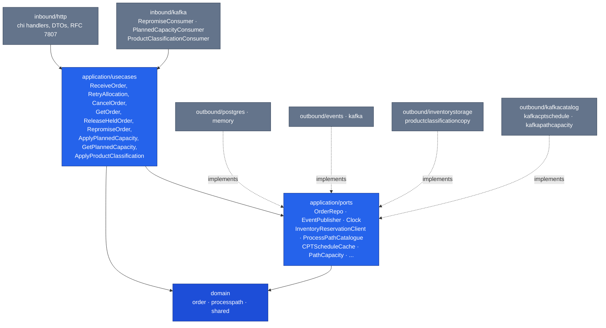

# Architecture

The service is **hexagonal (ports & adapters)** with one non-negotiable rule:

> **domain depends on nothing; application depends on domain; adapters
> depend on application/domain.**

No framework type, no `chi` router, no `pgx` connection, and no SQL string
ever appears inside `internal/domain/`.

## Layout

```text
cmd/order/                    main.go — composition root of the OLTP service
cmd/mcp/                      read-only MCP server (Streamable HTTP, ADR 0010)
cmd/order-projector/          analytics projector — Kafka -> analytics DB (ADR 0006)
cmd/order-reports/            analytics read API (order funnel report)
internal/
  domain/
    order/                    Order aggregate, OrderLine, Status, invariants,
                               PromisePolicy (+ LeadTimePolicy fallback),
                               PathSelectionPolicy
    processpath/              process-path definitions
    shared/                   value objects: OrderId, SKU, PathId, events, errors
  application/
    ports/                    OUT: OrderRepo, EventPublisher, UnitOfWork, Clock,
                               OrderMetrics, InventoryReservationClient,
                               ProcessPathCatalogue, CPTScheduleCache,
                               ProductClassificationLookup, PathCapacity,
                               RepromiseProcessedEvents, PlannedCapacityRepo,
                               PlannedCapacityProcessedEvents,
                               ProductClassificationCopy,
                               ProductClassificationProcessedEvents
    usecases/                 ReceiveOrder, RetryAllocation, CancelOrder,
                               GetOrder, ReleaseHeldOrder, RepromiseOrder,
                               ApplyPlannedCapacity, GetPlannedCapacity,
                               OrderCapacityConstraints, ApplyProductClassification
                               (allocation + release folded into allocateAndRelease)
  adapters/
    inbound/http/             chi handlers, DTOs, RFC 7807 error mapping,
                               Idempotency-Key middleware, readiness gate
    inbound/kafka/            RepromiseConsumer (warehouse.fulfillment.events),
                               PlannedCapacityConsumer (warehouse.warehouse-planning.events),
                               ProductClassificationConsumer (warehouse.product-master.events),
                               AnalyticsConsumer (cmd/order-projector)
    inbound/mcp/              MCP tools
    kafka/cloudevents/        the only CloudEvents 1.0 New/Decode helper (ADR 0030)
    outbound/inventorystorage/  HTTP client: POST /reservations,
                                 DELETE /reservations/{id}
    outbound/productclassificationcopy/  local copy of product-master classifications
                                 (Postgres / in-memory) + permissive lookup (ADR 0036)
    outbound/kafka/           integration + analytics publishers
    outbound/kafkacatalog/    process-path catalogue cache (Kafka)
    outbound/kafkacptschedule/  CPT schedule cache (Kafka)
    outbound/kafkapathcapacity/ path capacity cache (Kafka)
    outbound/pathcapacity/    "unknown capacity" default
    outbound/postgres/        pgxpool repos, transactional outbox + relay,
                               unit of work, housekeeping sweeper
    outbound/memory/          in-memory repos + clocks
    outbound/events/          log publisher (default EVENT_PUBLISHER=log)
    outbound/analyticsstore/  analytics projection + report queries
    outbound/telemetry/       OpenTelemetry metrics and traces (OTLP push)
  analytics/report/           analytical read model (depends on nothing internal)
  bootretry/, resilience/, pgtx/  boot retry, circuit breakers, tx-in-context
migrations/                   golang-migrate SQL files (+ migrations/analytics)
apis/openapi.yaml, apis/asyncapi.yaml
docs/docs/adr/                Architecture Decision Records
```

## The dependency flow



Solid arrows are compile-time imports; dashed arrows are interface
satisfaction. No arrow points from the application layer into an adapter —
the application only ever names an interface in `application/ports`, and
`cmd/order/main.go` is the only place that decides which implementation
gets plugged in. See [ADR 0001](/docs/adr/0001-hexagonal-ports-and-adapters).
The rule is enforced by `internal/architecture` (the `arch-test` CI job).

## Ports

| Port | Responsibility | Implementations |
| --- | --- | --- |
| `OrderRepo` | Persist/retrieve `Order`; mint IDs | `postgres`, `memory` |
| `EventPublisher` | Publish a `shared.DomainEvent` | `events` (log), `postgres` (transactional outbox, ADR 0022), `kafka` (integration + analytics fan-out, direct or via the outbox relay) |
| `UnitOfWork` | Bracket a Save + Publish(es) atomically (ADR 0022) | `postgres` (real Postgres transaction), nil (pass-through) |
| `Clock` | `Now()` — makes promise computation deterministic in tests | `memory.SystemClock`, fixed clocks in tests |
| `OrderMetrics` | Order accepted/rejected counter | `telemetry` (OpenTelemetry) |
| `InventoryReservationClient` | `Reserve`/`Revoke` against inventory-storage | `outbound/inventorystorage` (http), permissive no-op |
| `ProductClassificationLookup` | Product attributes for path eligibility (ADR 0016), read from a local copy of product-master events (ADR 0036) | `outbound/productclassificationcopy` (Postgres, memory), permissive |
| `ProductClassificationCopy` | Version-guarded write side of that copy (ADR 0036) | `outbound/productclassificationcopy` (Postgres, memory) |
| `ProductClassificationProcessedEvents` | Idempotency gate for the product-classification consumer (ADR 0036) | `outbound/productclassificationcopy` (Postgres, memory) |
| `ProcessPathCatalogue` | Active paths + capability (ADR 0013/0014) | `outbound/kafkacatalog` |
| `CPTScheduleCache` | Site CPT schedule (ADR 0014) | `outbound/kafkacptschedule` |
| `PathCapacity` | Remaining path capacity per cutoff (ADR 0015) | `outbound/kafkapathcapacity`, `pathcapacity.Unknown` |
| `RepromiseProcessedEvents` | Idempotency gate for the re-promise consumer (ADR 0018) | `postgres`, `memory` |
| `PlannedCapacityRepo` | Local read model of warehouse-planning's capacity windows (ADR 0031) | `postgres`, `memory` |
| `PlannedCapacityProcessedEvents` | Idempotency gate for the planned-capacity consumer (ADR 0031) | `postgres`, `memory` |

The inventory-storage reservation client is env-selected
`INVENTORY_STORAGE_MODE=http|permissive` and the classification lookup
`PRODUCT_CLASSIFICATION_MODE=kafka|permissive` (both defaulting to
`permissive`, so unit tests never hit the network; `http` for
classification was removed by ADR 0036 and fails boot). The
classification lookup fails open like the fleet's other soft lookups; the
reservation client does not — allocation against a permissive client
returns a clear `ErrDownstreamNotConfigured` rather than a fabricated
success. Only `http` mode is suitable for a real integration test or
deployment.

## Composition root

`cmd/order/main.go` (with its siblings `wiring.go` and
`planned_capacity.go`) is the composition root: the only place that knows
both a port and its implementation. Apart from `CORS_ALLOWED_ORIGINS` (read
by the HTTP adapter) and `ENVIRONMENT` (read by `telemetry`), every
environment variable is read there:

| Env var | Default | Effect |
| --- | --- | --- |
| `HTTP_ADDR` | `:8080` | Listen address |
| `LOG_LEVEL` | `info` | slog level |
| `SHUTDOWN_DRAIN_DELAY` | `5s` | Wait after `/readyz` flips to not-ready before the listener closes (ADR 0025 §8); `0` disables |
| `DATABASE_URL` | *(unset)* | If unset, the in-memory adapters are used and no database is required (no `Idempotency-Key` middleware, no outbox, no sweeper). |
| `MIGRATIONS_DATABASE_URL` | `DATABASE_URL` | Direct (non-PgBouncer) DSN for the migration step only (ADR 0029) |
| `MIGRATIONS_PATH` | `migrations` | Where golang-migrate looks for SQL files |
| `INVENTORY_STORAGE_MODE` | `permissive` | `http` or `permissive` |
| `INVENTORY_STORAGE_BASE_URL` | *(unset)* | Required when mode is `http` (reservations only) |
| `PRODUCT_CLASSIFICATION_MODE` | `permissive` | `kafka` or `permissive` (ADR 0036); `http` fails boot |
| `PRODUCT_CLASSIFICATION_CONSUMER_GROUP` | *(unset)* | Stable consumer group of the classification copy's consumer; required with mode `kafka` (ADR 0036) |
| `EVENT_PUBLISHER` | `log` | `kafka` adds the integration + analytics topics (through the outbox when `DATABASE_URL` is set) |
| `KAFKA_BROKERS` | `localhost:9092` when publishing; unset disables the re-promise and planned-capacity consumers | Comma-separated brokers |
| `OUTBOX_RELAY_INTERVAL` | `1s` | Outbox relay poll interval (ADR 0022) |
| `HOUSEKEEPING_INTERVAL`, `IDEMPOTENCY_KEY_TTL`, `OUTBOX_RETENTION` | `1h`, `24h`, `168h` | Housekeeping sweeper (ADR 0032); `HOUSEKEEPING_INTERVAL=0` disables it |
| `PATH_CATALOGUE_SOURCE` | `none` | `kafka` enables the catalogue, CPT-schedule and path-capacity caches (capability promise); `none` = lead-time promise only |
| `DEFAULT_SITE_ID` | `site-1` | Site whose CPT schedule the promise reads |
| `PROMISE_DEFAULT_LEAD_TIME` | `48h` | Lead-time fallback for any unlisted path |
| `PROMISE_PATH_LEAD_TIMES` | *(unset)* | Per-path overrides, e.g. `pick=24h,singles=6h` |
| `PLANNED_CAPACITY_CONSUMER_GROUP` | *(unset)* | Turns on the warehouse-planning consumer and `GET /planned-capacity` (ADR 0031) |
| `PLANNED_CAPACITY_SITE_ID` | `DEFAULT_SITE_ID` | Site matched against planned-capacity windows |
| `CORS_ALLOWED_ORIGINS` | `http://localhost:5173,http://localhost:5181` | Console / MFE origins (ADR 0007) |
| `OTEL_EXPORTER_OTLP_ENDPOINT`, `OTEL_SERVICE_NAME` | `localhost:4317`, `order-management` | OpenTelemetry OTLP/gRPC export (no `/metrics` scrape route) |
| `SERVICE_VERSION`, `ENVIRONMENT` | `dev`, `local` | OpenTelemetry resource attributes |

The in-memory fallback is deliberate: `go run ./cmd/order` with no
environment at all starts a fully functional service, which is what makes
the `httptest` suite cheap to run.

## Quality gates

`.github/workflows/ci.yml` runs on every push and pull request:

| Job | What it enforces |
| --- | --- |
| `lint` | `golangci-lint` against the committed `.golangci.yml` |
| `guide-lint` | Agent-guide and harness sensors (`scripts/harness/`) |
| `complexity` | Cyclomatic/cognitive/nesting/function-size linters only |
| `test` | Unit tests with `-race`; coverage gate on `internal/domain/...,internal/application/...` |
| `bdd` | godog/Gherkin acceptance tests (`TestFeatures`) |
| `contract` | Schemathesis over `apis/openapi.yaml` (`scripts/contract-test.sh`) |
| `evals-tests` | MCP evals E1–E3 (`internal/adapters/inbound/mcp`) |
| `integration` | Kafka and Postgres adapters against Testcontainers |
| `mutation-fast` | gremlins on the domain layer, thresholds in `.gremlins.yaml` |
| `vuln` | `govulncheck` |
| `api-lint` | Spectral on `apis/openapi.yaml` / `apis/asyncapi.yaml` |
| `arch-test` | The hexagonal dependency rule (`internal/architecture`) |
| `docs-api-drift` | Regenerates the REST reference and diffs it |
| `web` | The MFE: lint, typecheck, test, build |
| `helm-lint`, `trivy-scan` | `charts/order-management`, image scan — PRs into `main` only |
| `docker-publish`, `release` | Image publish, GitFlow release — pushes to `main` only |

`mutation` (full) and `drift` run only on schedule / manual dispatch. This
documentation site is built and deployed by a separate workflow,
`.github/workflows/docs.yml`.
